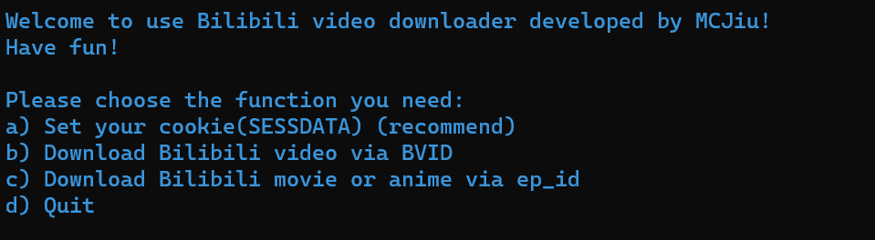

# BilibiliVideoDownloader
一个简单的用Python写的Bilibili视频下载器，支持下载视频、番剧、影视等内容。
本项目遵循[MIT开源协议](LICENSE)。
## 功能
目前实现了以下功能：
- 以BV号为索引下载视频
- 以ep_id为索引下载影视和番剧
- 以[cookie(SESSDATA)](https://www.bilibili.com/read/cv12349604)登录鉴权
## 环境要求
若以源码解释运行，需要安装以下依赖：
- [Python 3.11.2](https://www.python.org/) （测试环境，可能支持更低版本）
- [requests](https://pypi.org/project/requests/)
- [loguru](https://pypi.org/project/loguru/)

也可直接从Release下载使用已封装版本（使用pyinstaller打包）
## 使用提示
- 可以不经cookie鉴权下载视频，但只能下载非登录用户可观看的视频和清晰度
- 若要下载需大会员权限的影视和番剧等内容，请使用具有相应权限的账号登录，获取cookie(SESSDATA)。
- 目前音视频分流下载，不支持自动合流，可自行使用[ffmpeg](https://ffmpeg.org/)合流

## 开发计划
- [ ] 支持音视频自动合流